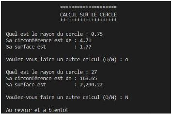
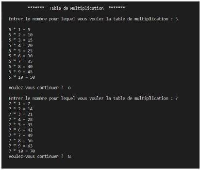
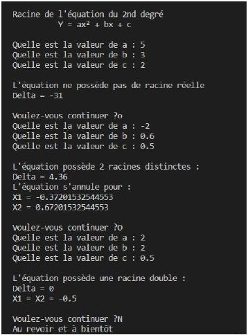
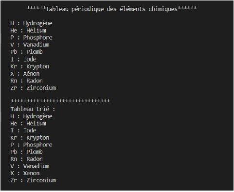

# ECF-PHP - 27 Avril 2023
Évaluation pour vérifier les connaissances de bases PHP  
Respectez les consignes  
## Consignes :  
* Le code doit etre propre, indenté et commenté
* attention aux noms de variables
* Les dialogues doivent etre respectés  

## [ECF-PHP](./profile/Doc/ECF-PHP.pdf)&nbsp;&nbsp;  

1. Calcul sur le cercle  

&nbsp;&nbsp;  

2. Table de multiplication  

&nbsp;&nbsp;  

3. Équation du second degré  

&nbsp;&nbsp;  

4. Tableaux périodiques des éléments  

&nbsp;&nbsp; 
